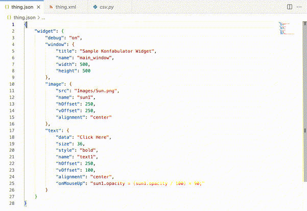

# semtab README

`semtab` is inspired by the tab behavior of HTML forms, allowing a user to
quickly jump between distinct meaningful input controls.

`semtab` provides keybindings that help developers quickly jump between entire
tokens in whatever programming language they're using, especially in cases
where a naive approach might result in multiple landing points within a token
or where multiple tokens are assigned a single landing point.

## Features

Semtab provides two commands:

- `semtab.previousToken`: Mapped to `alt-j` by default
- `semtab.nextToken`: Mapped to `alt-k` by default

Both commands will jump your cursor to an adjacent token, and in most cases
highlight that token so you can immediately start typing to replace it. Semtab
includes a default list of tokens that it jumps to but doesn't highlight, such
as at the end of parameter lists, so that you can start typing to extend them.

When reaching the end or the beginning of the document, focus will wrap around.

## Requirements

Semtab only works with languages that have syntax highlighting provided by a
TextMate grammar in VS Code.

## Extension Settings

Semtab provides default values for the following settings:

* `semTab.relevantScopes`: An array of TextMate scopes that your cursor will
  land on and highlight in addition to the default scopes
* `semTab.excludeScopes`: An array of TextMate scopes that are not considered
  useful for your cursor to land on, including things like assignment operators,
  in addition to the default exclusions
* `semTab.zeroWidthLandings`: An array of TextMate scopes that are useful to land
  on, but which should not be highlighted, in addition to the default landings.
  This includes scopes like the end of a function call, so you can extend th
  parameter list, but where the closing symbol wouldn't be useful to highlight.

## Known Issues

The default list of relevant scopes should have cross-language applicability, but
has been tested primarily for JSON, Typescript, and Python.

Performance could be better when using semtab to move through a large portion of a
file. It works fine for localized moves.

## Release Notes

### 1.0.1

Increased compatibility with past versions of VS Code

### 1.0.0

Initial release
